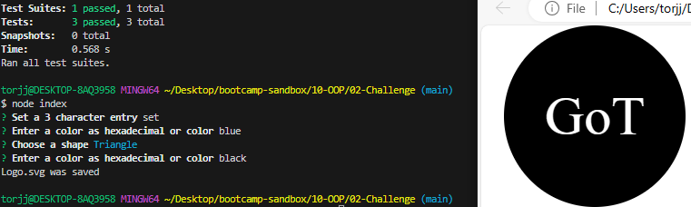

This is an SVG logo generator using JS

A user can enter 
```
node index
```
on the command line and follow the prompts to generate a logo of up to 3 letters to the exampleLogos folder. 

\

A user can verify the code with tests using the following script
```
 node --experimental-vm-modules node_modules/jest/bin/jest.js
 ```